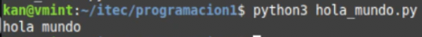

# Comienzo rápido!

## Estructura de carpetas (Árbol de directorios)
En Linux, oprimiendo la tecla Windows (en Linux le decimos SUPER) podemos acceder a todas las aplicaciones. Si hemos instalado Linux Mint, además tendremos un panel inferior donde veremos varias aplicaciones entre ellas el Explorador de Archivos y la Terminal.
<figure markdown="span">
  { width="200" }
  <figcaption>Panel Principal</figcaption>
</figure>
Cuando abrimos el Explorador de Archivos (Files) o bien ejecutamos una *terminal* (también llamada *consola*), nos encontramos parados en nuestro directorio (o carpeta) base.
Para cada usuario, su directorio base será */home/nombre_usuario*. 

En mi caso será **/home/kan/** (ese soy yo), y si vos sos Ana será **/home/ana/** y si sos Pedro será **/home/pedro/**

<figure markdown="span">
  { width="550" }
  <figcaption>Explorador de Archivos</figcaption>
</figure>

<figure markdown="span">
  { width="550" }
  <figcaption>Terminal</figcaption>
</figure>

Como se puede observar, en ambas aplicaciones veremos lo mismo: varias carpetas estándar como Documentos, Imágenes, etc.

Para armar la estructura mínima requerida para empezar, lo podemos hacer como seguramente sabemos, usando el Explorador de Archivos o bien la terminal. El resultado será el mismo.

La idea es que nos vayamos familiarizando con la terminal que es la herramienta habitual de todo Desarrollador.

Para dejar todo listo, crearemos una carpeta de nombre **itec** y dentro de ella otra carpeta de nombre **programacion1**.

Los siguientes comandos realizan esas acciones, con **mkdir** creamos un directorio y con **cd** entramos allí.
Podés copiar y pegar o escribir estos comandos en tu terminal y apretar la tecla **Enter**
``` console
mkdir itec
cd itec
mkdir programacion1
cd programacion1
```

!!! note "Importante!"
    Solamente letras minúsculas del alfabeto estándar -sin letras acentuadas ni eñe-, números y el caracter guión bajo para nombrar carpetas y archivos de programa. Si estás tentado a ponerle a una carpeta, por ejemplo:
    
    **Materia Programación 1 de Primer Año**, NO LO HAGAS, 
    
    en cambio ponele, por ejemplo:
    
    **programacion1** o **prog_1** (nombres de carpetas bien de programador 😏)


## Vamos ahora a prepararnos para programar!
Apenas se ingresa en el Editor de Texto, lo primero que hacemos es guardarlo, de ese modo le podemos poner un nombre y ubicarlo en la carpeta que hemos creado. Eso lo hacemos con la combinación de teclas  **Ctrl-S**. Se nos abrirá una ventana y allí ingresaremos en el directorio **itec** y luego en **programacion1**. Le ponemos de nombre **hola_mundo.py** y lo guardamos.

Si cerramos la ventana del archivo (NO la del editor), igualmente podemos abrir uno nuevo con **Ctrl-N** para luego repetir lo anterior, o sea grabarlo y asignarle un nombre. Verificar que tenga la extensión **.py** para que el editor reconozca que será un programa en Python y luego pueda ser ejecutado apropiadamente en la terminal.


## Escribamos nuestro primer programa!
Copiar y pegaren el editor:

```py
   print("hola mundo")
```
No olvidar grabar: **Ctrl-S** 

Ahora vamos a **ejecutar** el programa (en inglés: **run the program** -por eso los devs acostumbramos decir *"correr el programa"*). Es decir, hacerlo andar para obtener un resultado. Nos vamos a la terminal y escribimos allí:
``` console
python3 hola_mundo.py
```

Si todo está bien debería producirse la siguiente salida:

**hola mundo**



Hemos ejecutado el programa usando el intérprete **python3** y utilizamos nuestra primera **función**.

La función **print** nos sirve para mostrar datos por la pantalla (Ya seguiremos hablando de ella).

Si llegamos con éxito hasta aquí, hemos escrito y ejecutado nuestro primer programa en Python!
