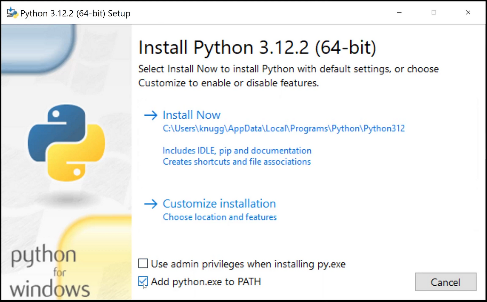

# Comienzo rápido!

### Descargar Python
desde aquí: [https://www.python.org/downloads/](https://www.python.org/downloads/)

### Instalar Python 
(DEBEN tildar la casilla de “Agregar al PATH”)



### Descargar Visual Studio Code
desde aquí: [Visual Studio Code](https://code.visualstudio.com/download)

### Instalar el editor **Visual Studio Code**
   
### Configurar el editor   
   - Configuración básica de VS Code (se hace por ÚNICA VEZ!)
     - **Ctrl-Shift-X** (Extensions): Escribir **python**, y luego instalar la extensión Python de Microsoft (aparece en primer lugar) 
     


   - *Recomendado*: configurar adicionalmente hotkeys para ejecución y terminal.
    - **File -> Preferences -> Keyboard Shortcuts**
    
Para la ejecución del programa: escribir **python run**, seleccionar “Run Python File in Terminal”, oprimir la combinación de teclas preferida (por ejemplo **Ctrl-Shift-F10**) y dar Enter para asignar:


Para ver o ir a la consola o terminal (el área inferior del editor donde se observa la ejecución del programa): escribir **view term**, aparece “View: Toggle Terminal”, oprimir la combinación (ejemplo: **Ctrl-T**)

### Vamos ahora a programar!
Antes de comenzar a usar el editor, crear una carpeta vacía para el proyecto desde el Explorador de Archivos de su sistema operativo. (Llamarla, por ejemplo, **primer_proyecto**)

Apenas se ingresa en el **VS Code**, abrir la carpeta recientemente creada (**primer_proyecto**) del siguiente modo: **Ctrl-K-Ctrl-O** -oprimen la tecla Ctrl y sin soltarla, oprimen la letra K y luego la letra O- o bien **File -> Open Folder**.

Luego **Ctrl-N**, para abrir un archivo en blanco, e inmediatamente, **Ctrl-S**, para asignarle un nombre al programa (**hola_mundo.py**) y grabarlo. Verificar que tenga la extensión **.py** para que el editor reconozca que será un programa en Python.

Verificar en la esquina inferior derecha si figura la versión de Python en uso (al momento de escribir esto, va por la 3.10.7, pero puede ser cualquier otra versión, siempre que sea superior a 3.7.0) para comprobar que el editor está reconociendo bien el programa y que Python esté instalado:


Listos para el Hola Mundo!
Copiar y pegar:
   ```py
   print("Hola Mundo")
   ```
Y ahora con el teclado: Ctrl-Shift-F10 (o la combinación que eligieron)

En la consola o terminal (la zona inferior de la pantalla del editor),
debería salir el cartelito:

**Hola Mundo**


Si llegamos con éxito hasta aquí, hemos escrito y ejecutado nuestro primer
programa en Python!


